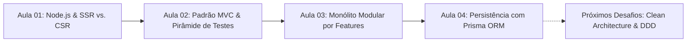

# 💻 Atividades & Portfólio de Aprendizado — Web II (TADS)

<p align="center">
  
  
  
  
  
  
  
</p>

---

## 👩‍💻 Sobre Mim e Contexto do Repositório

Olá! Meu nome é **Francine Moraes** e sou estudante do curso superior de **Tecnologia em Análise e Desenvolvimento de Sistemas (TADS)**.

Este repositório documenta minha jornada prática e estudos na disciplina de **Desenvolvimento Web II**. O projeto é baseado nos templates e desafios propostos pelo professor ao longo do semestre. A partir dessas bases, assumi a responsabilidade de implementar as **regras de negócio, decisões arquiteturais, camadas de persistência, rotas HTTP e suítes completas de testes automatizados**, simulando o fluxo real de trabalho e evolução de software do mercado.

---

## 🧠 Trilha de Aprendizado



---

## 📚 Desafios Semanais & Como Foram Resolvidos

### 📂 [Aula 01 — Fundamentos de Node.js, SSR vs. CSR & Testes Automatizados](file:///home/fran/Área%20de%20trabalho/webII/Aula01)

* 🎯 **Desafio Proposto:**
  * Compreender o funcionamento do runtime do Node.js (Event Loop, I/O assíncrono).
  * Comparar na prática duas abordagens para a mesma funcionalidade de lista de tarefas: renderizar no servidor (*Server-Side Rendering*) versus no navegador (*Client-Side Rendering*).
  * Iniciar a cultura de testes automatizados desde o primeiro dia.
* 🛠️ **O que foi implementado e resolvido:**
  * [`Aula01/ssr/`](file:///home/fran/Área%20de%20trabalho/webII/Aula01/ssr): Servidor Express entregando o HTML pronto e completo, garantindo carregamento inicial rápido e indexação para SEO.
  * [`Aula01/csr/`](file:///home/fran/Área%20de%20trabalho/webII/Aula01/csr): Servidor servindo um esqueleto estático e API REST em JSON, onde o JavaScript do cliente faz a montagem dinâmica do DOM.
  * [`Aula01/testes/`](file:///home/fran/Área%20de%20trabalho/webII/Aula01/testes): Suíte de testes unitários com **Vitest** cobrindo invariantes e regras de domínio (ex: algoritmo de validação de CPF).
* ✅ **Validação:** Testes unitários e de integração com Vitest e Supertest.

---

### 📂 [Aula 02 — Arquitetura MVC & Atributos de Qualidade](file:///home/fran/Área%20de%20trabalho/webII/Aula02)

* 🎯 **Desafio Proposto:**
  * Receber uma API de tarefas legada ([`Aula02/antes/`](file:///home/fran/Área%20de%20trabalho/webII/Aula02/antes)) com código acoplado e sem padrão (*Fat Handlers*, validações misturadas com resposta HTTP).
  * Refatorar a aplicação aplicando o padrão arquitetural **Model-View-Controller (MVC)** para melhorar a testabilidade e a modificabilidade.
* 🛠️ **O que foi implementado e resolvido ([`Aula02/depois/`](file:///home/fran/Área%20de%20trabalho/webII/Aula02/depois)):**
  * **Model (`domain/`)**: Isolei a entidade `Task` com validações de tamanho de título e regras de transição de estado (não concluir 2x, não renomear tarefa concluída), 100% desacoplada de HTTP.
  * **View (`views/`)**: Implementei *View Models* dedicados (`taskView.ts`) que preparam os dados antes de entregá-los aos templates **EJS**, eliminando lógica de dentro dos templates.
  * **Controller (`controllers/`)**: Criei controladores com foco exclusivo em orquestração de fluxo, chamando repositórios e devolvendo status HTTP adequados.
* ✅ **Validação (Pirâmide de Testes Completa):**
  * **Unitários**: Testes das regras de negócio do Model e testes do Controller isolado com *mocks* de repositório (`vi.fn()`).
  * **Integração**: Testes da comunicação entre repositório em memória, rotas e renderização de views.
  * **E2E**: Simulação da jornada completa do usuário (criação, edição, conclusão e exclusão de tarefas).

---

### 📂 [Aula 03 — Modularidade, Monólito por Features & Kanban Completo](file:///home/fran/Área%20de%20trabalho/webII/Aula03)

* 🎯 **Desafio Proposto:**
  * O projeto base ([`Aula03/kanban/`](file:///home/fran/Área%20de%20trabalho/webII/Aula03/kanban)) continha a visualização do quadro, mas nenhum botão funcional (todos os métodos de alteração lançavam `NotImplementedError` e respondiam `501`).
  * Implementar todas as operações do quadro Kanban mantendo a arquitetura organizada por *Features* (`boards/` e `cards/`) e respeitando o Princípio da Inversão de Dependência (DIP).
* 🛠️ **O que foi implementado e resolvido:**
  * **Criação e Gestão de Cartões (`POST /cards`, `POST /cards/:id/update`, `POST /cards/:id/delete`)**: Validação de existência de coluna, validação de campos e persistência.
  * **Movimentação entre Colunas (`POST /cards/:id/move`)**: Implementação do método `changeColumn` no Model e orquestração no Controller.
  * **Regra de Limite de WIP (*Work in Progress*)**: Criação do erro de domínio `WipLimitExceededError` impedindo excesso de tarefas em colunas com limite (ex: *"Em Andamento"*), respondendo com **HTTP 409 (Conflict)**.
  * **Bloqueio de Títulos Duplicados**: Criação do erro `DuplicateCardTitleError` (**HTTP 409**) quando houver tentativa de criar ou mover um cartão com nome repetido na mesma coluna.
  * **Criação de Colunas (`POST /columns`)**: Implementação do método `Board#addColumn` gerando ID e ordenação automática.
  * **Página de Detalhes e Busca de Cartões (Estica)**: Criação de `cardView.ts`, `views/cards/show.ejs` (`GET /cards/:id`) e busca com filtros (`GET /cards/search`).
* ✅ **Validação:** Todos os testes que antes respondiam `501` foram convertidos em testes de integração e E2E, atingindo **79 testes aprovados** e **100% de cobertura de código** (*Statements, Branches, Functions e Lines*).

---

### 📂 [Aula 04 — Camada de Persistência com ORM (Prisma & SQLite)](file:///home/fran/Área%20de%20trabalho/webII/Aula04)

* 🎯 **Desafio Proposto:**
  * Construir a camada de persistência relacional de uma API de Rede Social ([`Aula04/rede-social/`](file:///home/fran/Área%20de%20trabalho/webII/Aula04/rede-social)) com **Prisma ORM** sobre **SQLite**, resolvendo o *Impedance Mismatch*.
  * Modelar diferentes cardinalidades de banco de dados e aplicar os exercícios pós-aula (extensão de modelos e paginação/ordenação).
* 🛠️ **O que foi implementado e resolvido:**
  * **Modelagem Relacional no `schema.prisma`**:
    * **1:1**: `User` ↔ `UserProfile` (com deleção em cascata e chave única).
    * **1:N**: `User` ↔ `Post`, `User` ↔ `Address`, `Post` ↔ `Comment`, `Post` ↔ `Image`.
    * **N:N Implícita**: `Post` ↔ `Tag` (tabela de junção gerenciada automaticamente pelo Prisma).
    * **N:N Explícita / Autorrelação**: `User` ↔ `User` via `Follow` (seguidores/seguindo com chave composta `@@id([followerId, followingId])`) e curtidas via `Like` (`@@id([userId, postId])`).
  * **Versionamento de Banco de Dados**: Criação e execução de migrações estruturadas via `prisma migrate`.
  * **Utilitário Genérico de Paginação & Ordenação (`shared/pagination.ts`)**: Suporte a paginação com metadados (`page`, `limit`, `total`, `totalPages`, `skip`, `orderBy`) e filtros relacionais avançados.
* ✅ **Validação:** Suíte de 24 testes de integração utilizando banco SQLite temporário isolado por execução e requisições no `test.http`.

---

## 🔮 Roadmap / Próximos Conteúdos

Conforme novas aulas e desafios forem disponibilizados, este repositório será continuado com:

- [ ] **Aula 05**: Arquitetura em Camadas, Hexagonal (*Ports & Adapters*) e *Clean Architecture*.
- [ ] **Aula 06**: *Domain-Driven Design* (DDD) — Entidades, *Value Objects*, Agregados e Serviços de Domínio.
- [ ] **Aulas Futuras**: Autenticação/Autorização com JWT, Microsserviços e Deploy.

---

## 🛠️ Tecnologias & Ferramentas Utilizadas

| Categoria | Tecnologias |
| --- | --- |
| **Linguagem & Runtime** | [TypeScript](https://www.typescriptlang.org/) (Strict Mode), [Node.js](https://nodejs.org/) |
| **Backend & Servidor** | [Express.js](https://expressjs.com/), [EJS](https://ejs.co/) (View Engine) |
| **Persistência & ORM** | [Prisma ORM](https://www.prisma.io/), [SQLite](https://www.sqlite.org/) |
| **Testes Automatizados** | [Vitest](https://vitest.dev/), [Supertest](https://github.com/ladjs/supertest) |
| **Ferramentas de Desenvolvimento** | REST Client (.http), Git, GitHub |

---

## 🚀 Como Rodar os Projetos Localmente

### Pré-requisitos
* **Node.js** (v18 ou superior)
* **npm** ou gerenciador equivalente

```bash
# 1. Clone o repositório
git clone https://github.com/FranGnMoraes/atividades-webII-tads.git
cd atividades-webII-tads

# 2. Acesse a pasta da aula desejada (exemplo: Aula 03 - Kanban)
cd Aula03/kanban

# 3. Instale as dependências
npm install

# 4. Execute a suíte de testes automatizados com cobertura
npm run test:coverage

# 5. Inicie o servidor em modo de desenvolvimento
npm run dev
```

---

## 📬 Contato

Fique à vontade para entrar em contato ou acompanhar meus outros projetos:

* 🌐 **GitHub**: [@FranGnMoraes](https://github.com/FranGnMoraes)
* 💼 **LinkedIn**: [Francine Moraes](https://www.linkedin.com/in/francine-moraes)

---
<p align="center">Construído com foco em qualidade de código, arquitetura limpa e testes 🚀</p>
