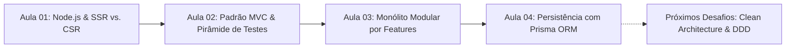

# 💻 Atividades & Portfólio de Aprendizado — Web II (TADS)

<p align="center">
  
  
  
  
  
  
  
</p>

---

## 👩‍💻 Sobre Mim e Este Repositório

Olá! Meu nome é **Francine Moraes** e sou estudante do curso superior de **Tecnologia em Análise e Desenvolvimento de Sistemas (TADS)**.

Este repositório serve como meu laboratório prático e portfólio de estudos da disciplina de **Desenvolvimento Web II**. Aqui documento minha evolução no desenvolvimento **Backend com Node.js e TypeScript**, aplicando padrões arquiteturais consolidados, boas práticas de Clean Code, testes automatizados e modelagem de banco de dados relacional com ORM.

---

## 🧠 O Que Aprendi e Desenvolvi Até Aqui



---

### 📂 [Aula 01 — Fundamentos de Node.js, SSR vs. CSR e Testes Automatizados](file:///home/fran/Área%20de%20trabalho/webII/Aula01)

Nesta etapa inicial, aprofundei meus conhecimentos sobre o funcionamento interno do **Node.js** (Event Loop, assincronismo com Promises/async-await e módulos) e analisei na prática os trade-offs entre renderização no servidor e no cliente:

* **O que desenvolvi e comparei**:
  * [`Aula01/ssr/`](file:///home/fran/Área%20de%20trabalho/webII/Aula01/ssr): Implementei uma aplicação com **Server-Side Rendering (SSR)** usando Express, onde o HTML é completamente renderizado no backend, otimizando SEO e tempo de carregamento inicial (TTFB).
  * [`Aula01/csr/`](file:///home/fran/Área%20de%20trabalho/webII/Aula01/csr): Construí a mesma aplicação em **Client-Side Rendering (CSR)**, consumindo dados via API REST (JSON) e montando o DOM dinamicamente via JavaScript no navegador.
  * [`Aula01/testes/`](file:///home/fran/Área%20de%20trabalho/webII/Aula01/testes): Estruturei testes unitários com **Vitest** para validação de regras de domínio e algoritmos (ex: cálculo e invariantes de CPF).

---

### 📂 [Aula 02 — Arquitetura MVC (Model-View-Controller) & Atributos de Qualidade](file:///home/fran/Área%20de%20trabalho/webII/Aula02)

Nesta aula, enfrentei o problema clássico de código legado desorganizado (*Fat Handlers* onde rotas, regras de negócio e banco de dados ficam misturados) e realizei uma refatoração completa aplicando o padrão **MVC**:

* **Minhas decisões arquiteturais**:
  * **Model (`domain/`)**: Isolei todas as entidades e regras de negócio puras (ex: validação de título, invariantes de status de tarefas), mantendo-as independentes de frameworks web.
  * **View (`views/`)**: Utilizei o motor de templates **EJS** e criei *View Models* dedicados (`taskView.ts`) para desacoplar a formatação de apresentação das entidades de domínio.
  * **Controller (`controllers/`)**: Estruturei controladores responsáveis apenas pela orquestração do fluxo HTTP e respostas de status adequadas, evitando *Fat Controllers*.
* **Pirâmide de Testes Completa**:
  * **Unitários**: Testes rápidos e isolados do Model e do Controller (usando `vi.fn()` para mockar repositórios).
  * **Integração**: Testes cobrindo a comunicação entre Repositório em memória, Controllers e Renderização de views via **Supertest**.
  * **E2E**: Simulação da jornada completa do usuário (criação, edição, conclusão e exclusão de tarefas).
* **Projetos**: [`Aula02/antes/`](file:///home/fran/Área%20de%20trabalho/webII/Aula02/antes) (legado) vs. [`Aula02/depois/`](file:///home/fran/Área%20de%20trabalho/webII/Aula02/depois) (refatorado em MVC).

---

### 📂 [Aula 03 — Modularidade, Monólito por Features & Princípio da Inversão de Dependência](file:///home/fran/Área%20de%20trabalho/webII/Aula03)

Avancei para a organização de projetos no modelo **Package by Feature** (agrupamento por contexto de negócio em vez de apenas por camadas técnicas), desenvolvendo um sistema Kanban completo:

* **O que implementei no [`Aula03/kanban/`](file:///home/fran/Área%20de%20trabalho/webII/Aula03/kanban)**:
  * Separação em módulos coesos: `boards/` (gerenciamento do quadro e colunas) e `cards/` (gerenciamento dos cartões e tarefas).
  * **Inversão de Dependência (DIP)**: Uso de interfaces para os repositórios (`BoardRepository`, `CardRepository`), garantindo baixo acoplamento e fácil substituição do mecanismo de persistência.
  * **Regras de Negócio Avançadas**: Implementação de limites de WIP (*Work in Progress*) nas colunas e validação de duplicidade de cartões com retorno de erros HTTP semânticos (400, 404, 409).
  * **Qualidade**: Mantive **100% de cobertura de testes** automatizados na suíte de testes do projeto.

---

### 📂 [Aula 04 — Camada de Persistência com ORM (Prisma & SQLite)](file:///home/fran/Área%20de%20trabalho/webII/Aula04)

Nesta aula, incorporei persistência relacional profissional utilizando o **Prisma ORM** sobre **SQLite**, resolvendo problemas de *Impedance Mismatch* e versionando a estrutura do banco via *Migrations*:

* **O que desenvolvi na API de Rede Social ([`Aula04/rede-social/`](file:///home/fran/Área%20de%20trabalho/webII/Aula04/rede-social))**:
  * **Modelagem Relacional Completa** no `schema.prisma`:
    * Relação **1:1**: `User` ↔ `UserProfile` (com deleção em cascata).
    * Relações **1:N**: `User` ↔ `Post`, `User` ↔ `Address`, `Post` ↔ `Comment`, `Post` ↔ `Image`.
    * Relação **N:N Implícita**: `Post` ↔ `Tag` (tabela de junção gerenciada pelo Prisma).
    * Relações **N:N Explícitas com Chaves Compostas**: `User` ↔ `User` via `Follow` (seguidores/seguindo com `@@id([followerId, followingId])`) e `Like` de posts (`@@id([userId, postId])`).
  * **Queries Avançadas do Prisma**: Consultas aninhadas com `include`, `connect`, `connectOrCreate` e filtros relacionais (ex: montagem de feed personalizado de quem o usuário segue).
  * **Utilitário Genérico de Paginação & Ordenação**: Desenvolvi um helper reutilizável (`shared/pagination.ts`) para suporte a paginação por página/limite e ordenação ascendente/descendente com metadados de totalização.
  * **Testes de Integração com Banco Real**: Suíte de testes com banco SQLite temporário isolado por execução.

---

## 🛠️ Tecnologias & Ferramentas Utilizadas

| Categoria | Tecnologias |
| --- | --- |
| **Linguagem & Runtime** | [TypeScript](https://www.typescriptlang.org/) (Strict Mode), [Node.js](https://nodejs.org/) |
| **Backend & Servidor** | [Express.js](https://expressjs.com/), [EJS](https://ejs.co/) (View Engine) |
| **Persistência & ORM** | [Prisma ORM](https://www.prisma.io/), [SQLite](https://www.sqlite.org/) |
| **Testes Automatizados** | [Vitest](https://vitest.dev/), [Supertest](https://github.com/ladjs/supertest) |
| **Ferramentas de Desenvolvimento** | REST Client (.http), Git, GitHub |

---

## 🚀 Como Rodar os Projetos Localmente

### Pré-requisitos
* **Node.js** (v18 ou superior)
* **npm** ou gerenciador de pacotes equivalente

### Executando qualquer uma das aulas:

```bash
# 1. Clone o repositório
git clone https://github.com/FranGnMoraes/atividades-webII-tads.git
cd atividades-webII-tads

# 2. Acesse a pasta do projeto (exemplo: Aula 04 - Rede Social)
cd Aula04/rede-social

# 3. Instale as dependências
npm install

# 4. Configure o banco de dados e rode as migrações/sementes (se aplicável)
npm run prisma:migrate
npm run prisma:seed

# 5. Execute os testes automatizados
npm test

# 6. Inicie o servidor em modo de desenvolvimento
npm run dev
```

---

## 📬 Contato

Fique à vontade para entrar em contato ou conferir meus outros projetos:

* 🌐 **GitHub**: [@FranGnMoraes](https://github.com/FranGnMoraes)
* 💼 **LinkedIn**: [Francine Moraes](https://www.linkedin.com/in/francine-moraes)

---
<p align="center">Construído com foco em qualidade de código, arquitetura limpa e testes 🚀</p>
